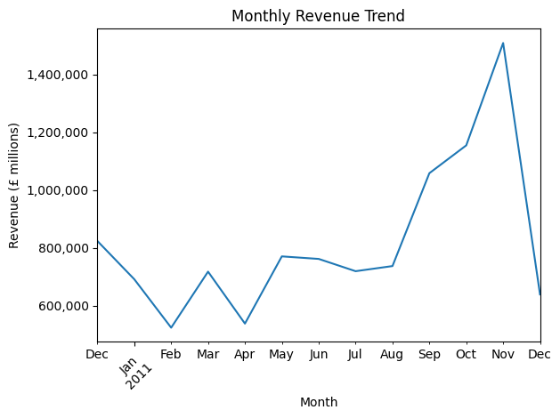
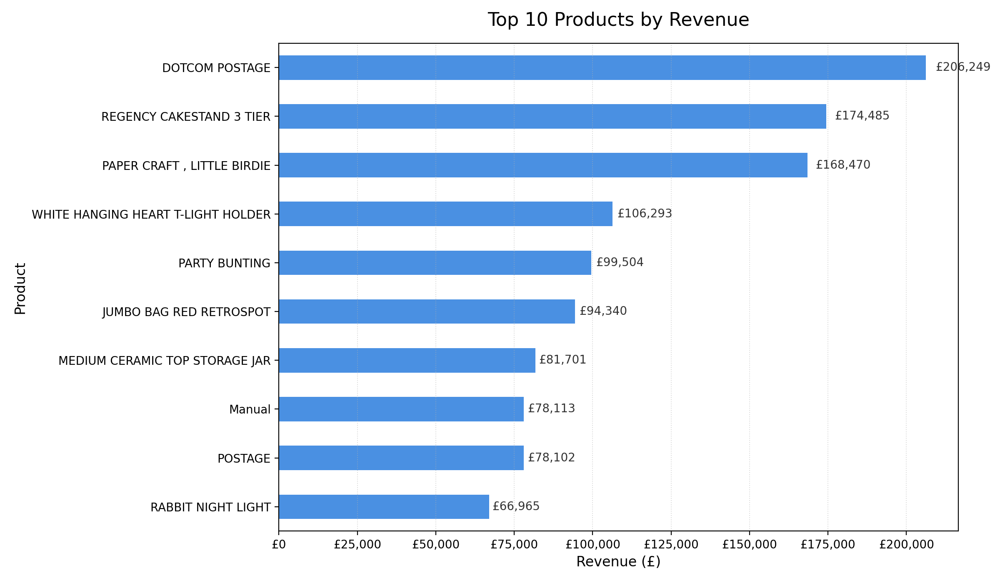
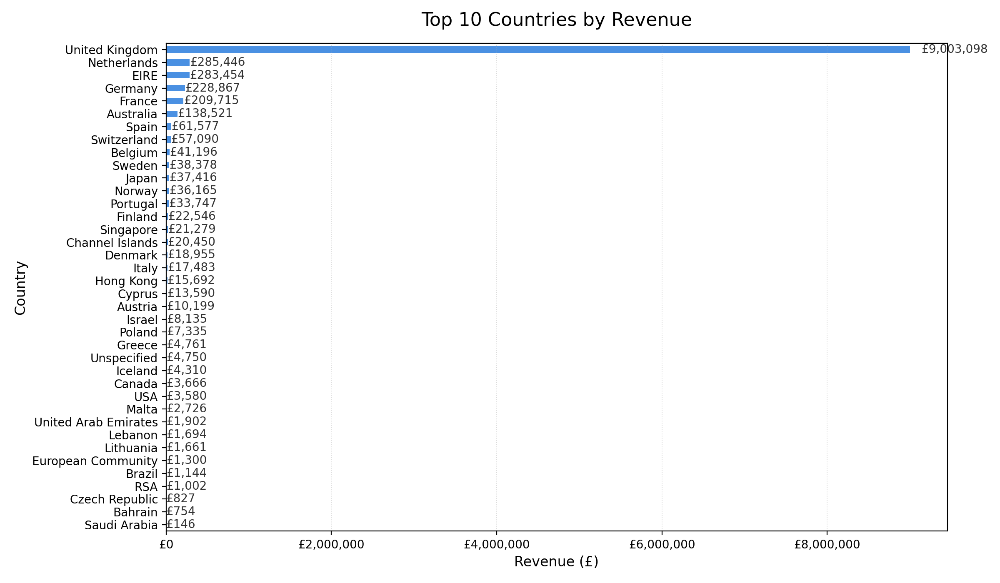

# Retail Sales KPI Analysis

[](https://python.org)
[](https://mysql.com)
[](https://retail-sales-kpi-analysis.streamlit.app)
[](LICENSE)

End-to-end data engineering and analytics pipeline that transforms raw retail transactions into validated, structured, and business-ready insights. Covers ingestion, cleaning, MySQL storage, automated data quality checks, KPI generation, and visual reporting.

**Dataset:** Online Retail 2010–2011 · ~500K transactions · £10.6M revenue · 38 countries

---

## Live Dashboard

Interactive Streamlit dashboard - filter by date range and country, explore monthly revenue trends, top products, and data quality metrics.

[Open dashboard](https://retail-sales-kpi-analysis.streamlit.app) - upload the dataset CSV (Kaggle link in the sidebar) and the dashboard loads instantly.

---

## Pipeline Architecture

```
CSV (Kaggle)
    |
src/load_data.py       cleaning, validation, MySQL insert
    |
src/data_quality.py    automated quality checks
    |
src/generate_report.py KPI calculation, chart generation
    |
outputs/               PNG charts
reports/               summary report
```

---

## Key Results

| Metric | Value |
|---|---|
| Total revenue | ~£10.6M |
| Transactions (cleaned) | ~400K |
| Countries | 38 |
| Top revenue source | United Kingdom |
| Seasonal peak | Q4 (Oct–Dec) |

---

## Tech Stack

| Tool | Use |
|---|---|
| Python, Pandas, Matplotlib | ETL, analysis, visualisation |
| MySQL 8.0 | Structured storage and querying |
| Streamlit | Interactive dashboard |
| Git, GitHub | Version control |

---

## Setup

**1. Get the dataset**

Download from Kaggle and place in the `data/` folder:
[Online Retail Dataset](https://www.kaggle.com/datasets/ulrikthygepedersen/online-retail-dataset)

**2. Create and activate a virtual environment**

```bash
python -m venv venv
venv\Scripts\activate       # Windows
source venv/bin/activate    # macOS/Linux
```

**3. Install dependencies**

```bash
pip install -r requirements.txt
```

**4. Configure MySQL**

Update the connection details in `src/load_data.py`:

```python
host = "localhost"
user = "your_user"
password = "your_password"
database = "retail_db"
```

**5. Run the pipeline**

```bash
python src/load_data.py
python src/data_quality.py
python src/generate_report.py
```

**6. Run the Streamlit dashboard**

```bash
streamlit run streamlit_app.py
```

---

## Visual Outputs

### Monthly Revenue Trend


### Top 10 Products by Revenue


### Top 10 Countries by Revenue


---

## Data Quality Checks

The pipeline runs automated checks after loading:

- Missing CustomerID detection and removal
- Negative quantity and price filtering
- Cancellation removal (InvoiceNo starting with C)
- Duplicate transaction detection
- Country distribution validation

---

## Limitations

- Dataset is historical (2010–2011)
- No customer-level segmentation or cohort analysis
- No product category hierarchy
- No currency conversion
- MySQL schema is intentionally simple for demonstration purposes

---

## Future Improvements

- SQL-based aggregation for performance comparison with Pandas
- Customer segmentation using RFM analysis
- Automated unit tests
- Logging and pipeline error handling
- PostgreSQL migration

---

## Author

**Karan Homayounfar** · MSc Data Science, UWE Bristol
[Portfolio](https://karan-portfolio-al7.pages.dev) · [LinkedIn](https://linkedin.com/in/karan-homayounfar) · [GitHub](https://github.com/KNHNF)

## License

MIT — free to use, modify, and build upon.
